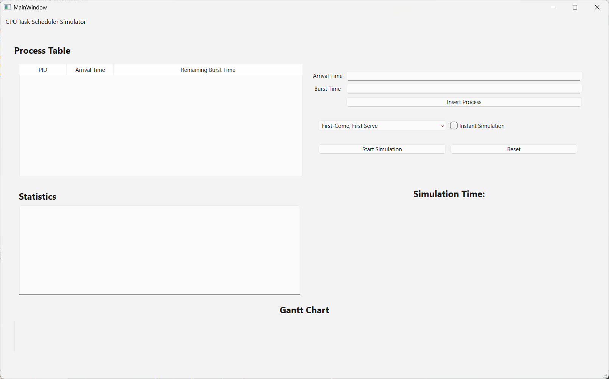
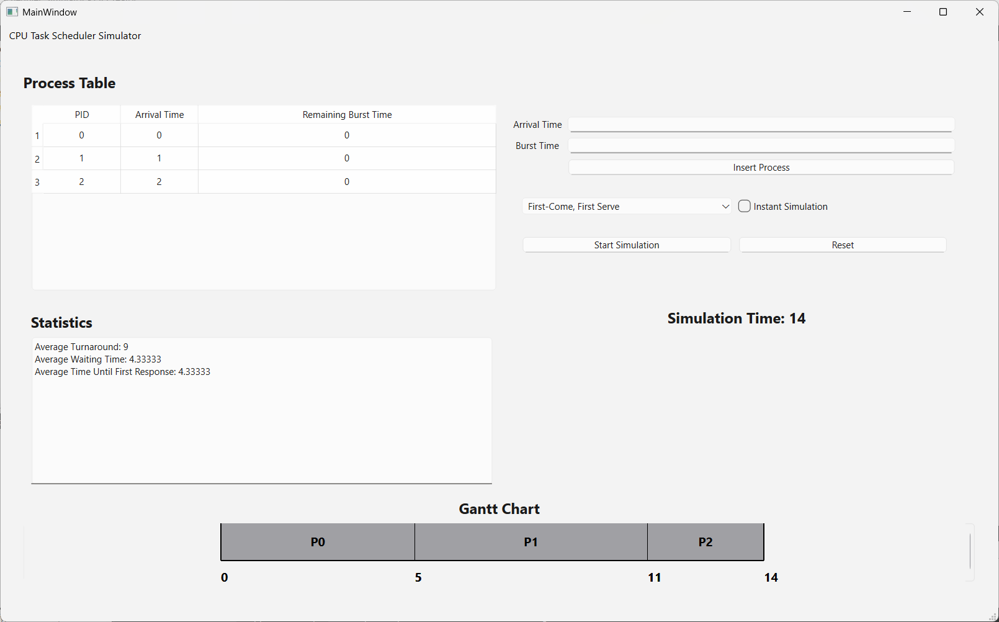

# CPU Scheduler Simulation

## Project Overview

This project simulates various CPU scheduling algorithms in an interactive desktop application. The application provides a graphical user interface (GUI) built using Qt and supports dynamic process addition while the scheduler is running. The simulation operates in real-time, with each unit of time mapped to 1 second, and updates the remaining burst time table live. The application uses multithreading in the backend to handle the scheduling logic, ensuring a smooth user experience without interface lag.

The implemented CPU schedulers include:
- **First-Come, First-Served (FCFS)**
- **Shortest Job First (SJF)** (Preemptive and Non-Preemptive)
- **Priority Scheduling** (Preemptive and Non-Preemptive) *(smaller priority numbers indicate higher priority)*
- **Round Robin (RR)**

---  

## Features

### Inputs
- **Scheduler Type**: Choose the desired scheduling algorithm (FCFS, SJF, Priority, or Round Robin).
- **Process Information**: Provide the required details for each process based on the chosen scheduler:
  - **FCFS**: Arrival time and burst time.
  - **SJF**: Arrival time and burst time.
  - **Priority**: Arrival time, burst time, and priority.
  - **Round Robin**: Arrival time, burst time, and Time quantum.
- **Dynamic Process Addition**: Add new processes dynamically during runtime by interacting with the GUI.

### Operation
- **Live Scheduling**: Simulate the scheduling process in real-time, with each unit of time mapped to 1 second.
- **Non-Live Mode**: Option to run all existing processes without live scheduling.
- **Remaining Burst Time Table**: Updated live as the simulation progresses.
- **Instant Simulation Termination**: Allows users to stop the simulation immediately and view the final results without waiting for all processes to complete.
- **Reset**: Clears all simulation data, allowing users to start a new simulation from scratch.

### Outputs
1. **Gantt Chart**: Visual representation of the order and duration of each process.
2. **Performance Metrics**:
   - **Average Waiting Time**: Calculated and displayed in the GUI.
   - **Average Turnaround Time**: Calculated and displayed in the GUI.
   - **Average Time till the first response**: Calculated and displayed in the GUI.
3. **Remaining Burst Time Table**: Updated live during the simulation.

---

## Screenshots

### Main Interface

### Output

---

## Technology Stack

- **Programming Language**: C++ 
- **GUI Framework**: Qt 

---

## How to Use

### Input
1. **Choose Scheduler Type**: Select the desired scheduling algorithm from the dropdown menu.
2. **Add Processes**: Enter the required information for each process (e.g., arrival time, burst time, priority, etc.). Unused information is not requested (e.g., no priority input for FCFS).
3. **Dynamic Process Addition**: Add new processes during runtime by interacting with the GUI.

### Output
- Observe the **Gantt Chart**, **average waiting time**, **average turnaround time**, and the **remaining burst time table** as the simulation progresses.

---

## Future Enhancements

To further improve this project, the following features can be implemented:
- **Additional Scheduling Algorithms**:
  - Multilevel Queue Scheduling.
  - Multilevel Feedback Queue Scheduling.
- **Save/Load Functionality**:
  - Allow users to save and load process configurations for later use.
- **Improved GUI**:
  - Add more interactive features, such as tooltips and animations.
  - Enhance the visualization of the Gantt Chart and performance metrics.

---

## Acknowledgments
Special thanks to our course instructor for providing the project guidelines and support.
